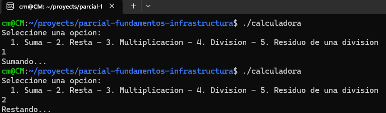

# Parcial Fundamentos de infrastructura

## Calculadora en lenguaje ensamblador

Presentado por

> Cesar Manuel Baquiro - https://github.com/CesarBaquiro
> 

---

## Iniciamos instalando Git en nuestras maquinas WSL

Hicimos uso del comando

```bash
sudo apt install git
```

Después configuramos nuestros usuarios

```bash
$ git config --global user.name "nombre"
$ git config --global user.email correo@gmail.com
```

Después al intentar realizar un `git push` nos dimos cuenta de un error persistente aun ingresando las credenciales. Para solucionar esto encontramos el siguiente foro 

[Problema en autenticar GitHub en WSL de Windows](https://es.stackoverflow.com/questions/562913/problema-en-autenticar-github-en-wsl-de-windows)

Con este comando se soluciono

```bash
git config --global credential.helper "/mnt/c/Program\ Files/Git/mingw64/libexec/git-core/git-credential-wincred.exe"
```

---

# Iniciamos el código

Primero realizamos un primer código de prueba y tanto el ingeniero Cesar como el ingeniero Daniel probamos la creación y pusheo de los commits para verificar que nuestro repositorio de GIT estaba listo.

Después nos dimos a la tarea de iniciar con el menú

## 1. Creación de menú

Usamos como base el código del ejercicio de practica en el cual se recibe un texto por parámetro y ese mismo se imprime en pantalla, después realizamos la modificación el mensaje dentro del `section .data` y la agregación de uno nuevo

```nasm
 mensaje db 'Seleccione una opcion: ', 0xA ; Mensaje a mostrar seguido de un salto de línea
 opciones db ' 1. Suma - 2. Resta - 3. Multiplicacion - 4. Division - 5. Residuo de una division ', 0xA ; Opciones
```

Teniendo en cuenta que el mensaje debe usar una longitud correspondiente para poder mostrarse de manera correcta para eso usamos una longitud de 90 bytes en `mov edx, 90`

Por ultimo el código continua la ejecución que tenia el código base (Imprimir el texto ingresado por el usuario), después realizamos el [merge](https://github.com/CesarBaquiro/parcial-fundamentos-infrastructura/commit/da057a1d4b66dd4aeca8cb0212b1ecb24e3f81f9) de la rama [initialCode](https://github.com/CesarBaquiro/parcial-fundamentos-infrastructura/tree/initialCode) a la rama [main](https://github.com/CesarBaquiro/parcial-fundamentos-infrastructura/tree/main) para continuar con la siguiente funcionalidad

## 2. Abrir un bloque de ejecución con la opción seleccionada

Para este paso primero vamos a crear bloques de código separados, para que por ejemplo, cuando se ingrese la opción 1 por consola la respuesta sea

> Sumando…
> 

De esta manera podremos comprobar que se ejecutan las funciones de manera correcta

Después de muchos intentos se logro implementar la funcionalidad que mostrar el mensaje, para esto agregamos 2 funciones de prueba, `sumar` y `restar`

```nasm
sumar:
        ; Escribir el mensaje de sumando en la consola
        mov eax, 4          ; Número de llamada del sistema sys_write
        mov ebx, 1          ; Descriptor de archivo 1 (stdout)
        mov ecx, msg_suma    ; Dirección del mensaje que se va a escribir
        mov edx, 11         ; Longitud del mensaje (42 bytes)

        int 0x80
        jmp salir

restar:
        ; Realizar la resta
        ; Escribir el mensaje de restando en la consola
        mov eax, 4          ; Número de llamada del sistema sys_write
        mov ebx, 1          ; Descriptor de archivo 1 (stdout)
        mov ecx, msg_resta
        mov edx, 12
        
        int 0x80
        jmp salir
```

> Nota: Se agrego el comando `int 0x80` y `jmp salir` al final de cada bloque de código para que al ser ejecutado cualquiera de los bloques no continúen con la ejecución de los que siguen en su parte inferior
> 

y dentro de la función `_start` se agrego una comprobación en caso de que el `buffer` sea igual a `‘1’`usando la etiqueta comparativa `cmp`

```nasm
        cmp byte [buffer], '1'
```

y por ultimo si esto es correcto la ejecución de je para realizar el salto a la función `sumar:`

```nasm
        je sumar             
```

finalmente los dos bloques de código para la comparación quedaron así

```nasm
        cmp byte [buffer], '1'
        je sumar            

        cmp byte [buffer], '2'
        je restar            
```

Finalmente al ejecutar el código podemos ver la siguiente respuesta



---

## 3. Realizar operaciones

Para crear las operaciones se usa el bloque de código seleccionado y se ejecuta la tarea a realizar, por ejemplo para la suma se hizo uso del comando `add` haciendo que el registro `eax` se adicione al registro `ebx` algo como esto

```nasm
 add ebx, eax ; Sumar el segundo número al primero
```

pero para que esto funcione previamente los datos ingresados deben ser convertidos de texto a números enteros, para eso se creo la  función `str2intNum1`  y `str2intNum2` haciendo referencia a String to Int, de cada numero a convertir y dentro se la funcion se realizo la siguiente conversión

```nasm
; Función para convertir una cadena a un entero
str2intNum1:
        mov eax, 0
        mov ecx, 10
        mov esi, num1 ; Dirección del buffer que contiene el número
        next_char1:
                movzx edx, byte [esi]
                cmp edx, '0'
                jl end_str2intNum1
                cmp edx, '9'
                jg end_str2intNum1
                sub edx, '0'
                imul eax, ecx
                add eax, edx
                inc esi
                jmp next_char1
        end_str2intNum1:
                ret
```

Y en la función `str2intNum2` solo cambia la dirección del buffer a `num2` al igual que la función `next_char1` y su finalización `end_str2intNum1`

## 4. Imprimir resultado

Para imprimir el resultado tenemos que volver a reescribir de un numero entero a un string para eso se creo la funcion `int2str` haciendo referencia a int to string, la cual usamos despues dentro de la funcion `print_result` para lograr imprimir los datos al finalizar.

La funcion `int2str` recorre los digitos y convierte el valor de la siguiente manera

```nasm
; Función para convertir un entero a una cadena
int2str:
        mov ecx, resultado ; Dirección del buffer que contiene el resultado
        mov ebx, eax ; Valor a convertir
        mov eax, 0
        next_digit:
                xor edx, edx
                div ecx
                add dl, '0'
                dec ecx
                mov [ecx], dl
                test ebx, ebx
                jnz next_digit
                ret
```

Despues en la funcion `print_result` imprimimos el mensaje de la variable `msg_resultado` mostrando por pantalla

> El resultado es:
> 

y hacemos uso de la funcion anterior, asignando el valor producido por la operacion a la variable `resultado`

```nasm
print_result:
        ; Imprimir el mensaje de resultado
        mov eax, 4
        mov ebx, 1
        mov ecx, msg_resultado
        mov edx, 16
        int 0x80

        ; Convertir el resultado a cadena y mostrar
        mov eax, ebx ; El resultado está en ebx
        call int2str ; Convertir el entero a cadena

        ; Imprimir la cadena resultante
        mov eax, 4
        mov ebx, 1
        mov ecx, resultado ; Dirección del buffer que contiene el resultado
        mov edx, 128       ; Longitud máxima del resultado
        int 0x80

        ret
```

Aunque el proceso se realizo según lo investigado y haciendo uso de las necesidades y sintaxis del lenguaje ensamblador el resultado no fue el esperado. Cada una de las ejecuciones tenían como resultado un error

```bash
segmentation fault (core dumped)
```

Por lo que se debió realizar una refactorización de algunas secciones del código después de una asesoría con el docente

## 5. Refactorización para corregir error

Para refactorizar el código se realizaron cambios en su estructura, como calcular el tamaño de cada cadena mensaje al ser creado, por ejemplo:

```nasm
        mensaje            db              10,'Seleccione una opcion:',10,0
        lmensaje           equ             $ - mensaje
```

También se cambiaron las llamadas al sistema, de `int 0x80` a `int 80h` también se añadió una conversión de valores ingresando el dato de ascii a decimal, haciendo uso de `sub ah, ‘0’` 

Otra cosa fundamental para que el código funcionara de manera correcta fue realizar cambios en la impresión del resultado, pasando de una lógica compleja usando funciones de string a entero y de entero a string

```nasm
        ; Convertir los números de texto a enteros
        mov ecx, num1
        call str2intNum1
        mov ebx, eax ; Guardar el primer número en ebx

        ; Convertir el segundo número de texto a entero
        mov ecx, num2
        call str2intNum2
        add ebx, eax ; Sumar el segundo número al primero

        ; Imprimir el resultado
        call print_result

        jmp main_loop
```

a algo mas sencillo y funcional como esto

```nasm
        ; Convertimos el resultado de la suma de decimal a ascii
        add al, '0'

        ; Movemos el resultado a un espacio reservado en la memoria
        mov [resultado], al
        
        mov eax, 4
        mov ebx, 1
        mov ecx, msg_resultado
        mov edx, lmsg_resultado
        int 80h

        ; Imprimimos en pantalla el resultado
        mov eax, 4
        mov ebx, 1
        mov ecx, resultado
        mov edx, 2
        int 80h
```

Finalmente el resultado esperado se mezclo a la rama `main` del repositorio

[GitHub - CesarBaquiro/parcial-fundamentos-infrastructura: Desarrollo del parcial 2 de Fundamentos de infrastructura computacional](https://github.com/CesarBaquiro/parcial-fundamentos-infrastructura/tree/main)
